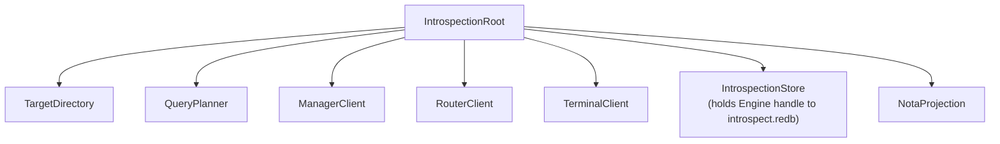

# persona-introspect - architecture

*Persona inspection-plane daemon and CLI.*

## 0. Intent

`persona-introspect` is the prototype's inspection-plane component. It is
supervised alongside the operational first stack and gives the engine a way to
explain itself through typed component observations.

It is not in the message delivery path. It proves the delivery path after the
fact.

## 1. Owned surface

- `persona-introspect-daemon`
- `introspect` CLI
- Kameo actors for query planning, target directory, target clients, NOTA
  projection, and `IntrospectionStore` (state-bearing local store).
- `ManagerClient`, `RouterClient`, `TerminalClient` — Kameo actors
  that hold each peer daemon's socket path and send typed Signal
  requests to that peer's observation contract. Each client owns
  one peer relationship and is the sole path from
  `IntrospectionRoot` to that peer. `RouterClient` is the first
  live client: when a router socket is configured,
  `prototype_witness()` sends `RouterRequest::Summary` over a
  length-prefixed `signal-persona-router` frame and composes the
  typed reply into `PrototypeWitness.router_seen`. `ManagerClient`
  and `TerminalClient` remain scaffolds until their peer observation
  contracts and daemon ingress paths land.
- Fan-out to component daemons over Signal.
- Fan-in of typed observations as pushed subscription deltas.
- **`introspect.redb`** — persona-introspect's own typed database,
  consumed through `sema-engine`. Stores: query/reply/error audit
  trail (landed); subscription registrations; delivery trace
  cache keyed by `DeliveryTraceKey` (landed), populated today by
  typed ingress into `IntrospectionRoot` and eventually by Subscribe
  deltas from peer Tap streams. Observations are persisted as typed
  records.
- NOTA projection for humans, agents, and future UIs.

`DeliveryTraceKey` is introspection-domain state — an
introspection-owned key for joining router, harness, and terminal
observations that belong to the same message-delivery trace. It is
not a Signal exchange identifier and not request/reply correlation.
Transport ordering and reply matching belong to the Signal frame
layer; delivery-trace joining belongs to persona-introspect's own
store. The key has four fields:
`engine`, `message_identifier`, `originator`, and `hop_index`. The
first three fields join one message-delivery chain; `hop_index`
orders the observed hops without relying on clocks.

## 2. Non-ownership

This component does not own:

- `mind.redb`
- `router.redb`
- `terminal.redb`
- other peer component databases
- component row definitions
- router policy
- terminal delivery policy
- manager lifecycle policy

Every live observation crosses a component daemon boundary. Peer state
is reached only through peer daemon sockets and component contracts —
**never by opening peer redb files**. Offline redb readers, if they ever
exist, are separate debug tools.

`persona-introspect` depends on `sema-engine` for its own
`introspect.redb`. That is a one-way dependency; `sema-engine`
knows nothing about persona-introspect.

## 3. Actor map

## 4. Constraints

| Constraint | Witness |
|---|---|
| The daemon does not open peer redb files. | Source scan and tests: no `redb::Database::open` in live path against peer paths. |
| The daemon consumes `introspect.redb` through `sema-engine`. | `tests/store.rs`: root-handled requests persist a typed observation record, and the reopened store exposes the `sema-engine` operation log. Source scan: `Engine::open` call exists; no direct `redb` or `sema::Sema::open_with_schema` calls in this repo. |
| The CLI renders NOTA only at the edge. | CLI and projection tests; component clients return typed Signal replies; no `nota-codec` usage in daemon runtime path. |
| Prototype witness travels through Kameo actor root. | `tests/actor_runtime_truth.rs`. |
| The daemon binds `introspect.sock` and serves Signal frames. | `tests/daemon.rs` via `checks.*.test-daemon-socket`. |
| The daemon applies the managed spawn-envelope socket mode. | `checks.*.test-daemon-applies-spawn-envelope-socket-mode`. |
| Component observations remain component-owned. | Dependency graph: wraps `signal-persona-introspect`; target observation records come from each peer's `signal-persona-*` contract. |
| Every `IntrospectionRequest` variant declares a Signal root-verb mapping. | `signal_verb()` method on `IntrospectionRequest` returns `signal_core::SignalVerb` + round-trip tests asserting verb+payload alignment. Current read variants are `Match`; `SubscribeComponent` maps to `Subscribe`. |
| Peer observation is push subscription when the peer stream exists; before the stream lands, a prototype one-shot `Match` query is allowed only as an explicit witness path and never as a timer loop. | Source scan: no timer loops in `ManagerClient`/`RouterClient`/`TerminalClient`. `tests/actor_runtime_truth.rs::prototype_witness_queries_live_router_summary_socket` proves the current router path sends one typed `RouterRequest::Summary` Match frame and receives one typed reply. Future Subscribe paths must follow `skills/subscription-lifecycle.md`. |
| Subscription forwarding goes through `sema-engine`'s `Subscribe` primitive. | Source scan: `Engine::subscribe` is the only path that registers introspect-side subscriptions to peer streams. |
| `DeliveryTraceKey` is introspection-domain state and has four fields: engine, message identifier, originator component, and hop index. | `signal-persona-introspect` round trips the key; `tests/store.rs::delivery_trace_query_returns_four_hops_ordered_by_trace_key` records four events and reads them back ordered by `hop_index`. |
| `RouterClient` asks `RouterRequest::Summary` over the router socket when one is configured; `prototype_witness` composes the typed `RouterSummary` reply into `PrototypeWitness.router_seen`. | `tests/actor_runtime_truth.rs::prototype_witness_queries_live_router_summary_socket` starts a live router-frame peer socket, runs the real `IntrospectionRoot`, and asserts `router_seen == Some(ComponentReadiness::Ready)`. |
| Subscription open returns a typed snapshot and the per-stream token. | Per-peer client tests assert the first reply is the contract's typed snapshot record. |
| Subscription deltas push as typed events; consumers do not poll. | Source scan: no timer-based loops in client actors; each client opens one Subscribe stream per peer. |
| Subscription close is a typed Retract request; the final acknowledgement is a typed reply. | Per-peer client tests assert close → final ack → stream end. |

## 5. Status

The daemon binds a Unix socket, applies the requested socket mode
when supplied, and serves `signal-persona-introspect` frames
through the Kameo root. `IntrospectionStore` consumes
`introspect.redb` via `sema-engine`; the query/reply audit trail
is persisted as typed records through `Engine::assert`.

The remaining work:

- **Per-peer observation contracts.** Each peer's
  `signal-persona-*` crate carries its own observation request
  vocabulary (terminal, router, manager). `ManagerClient`,
  and `TerminalClient` are scaffolds today: they hold socket paths
  and supervise cleanly, but `prototype_witness()` returns `None`
  for their readiness fields until the contracts ship and the
  daemons accept the corresponding `*Frame` ingress. Destination:
  each client opens one Subscribe stream against its peer; deltas
  land in the local store.

  `RouterClient` is the first wired client. The router daemon
  accepts `signal-persona-message` frames for message ingress and
  `signal-persona-router::RouterFrame` Match frames for read-side
  observation. The router observation plane (Kameo
  `RouterObservationPlane`) answers `RouterRequest::Summary`,
  `RouterRequest::MessageTrace`, and `RouterRequest::ChannelState`.
  `RouterClient` sends a real `RouterFrame` Match request for
  `RouterSummaryQuery`, parses the typed `RouterSummary`
  reply, and `prototype_witness()` composes the result into
  `PrototypeWitness.router_seen` as `Some(ComponentReadiness::Ready)`
  when the engine identifier matches.

  Push subscription wiring follows the canonical lifecycle named
  in `~/primary/skills/subscription-lifecycle.md`: typed Subscribe
  request, typed snapshot reply, typed delta events, typed Retract
  close, final typed acknowledgement, end. The introspect store
  consumes the deltas through `Engine::assert` so the audit trail
  remains durable.
- **Subscription primitive in sema-engine.** `Engine::subscribe`
  is the only path that registers introspect-side subscriptions
  to peer streams. Gated on sema-engine's per-peer
  commit-then-emit semantics. Destination: `SubscribeComponent`
  wire variant + forwarded peer subscriptions + cache-backed
  `DeliveryTrace`. Until then, `DeliveryTrace` is populated by the
  root's typed delivery-trace event ingress; an empty event vector
  means no correlated Tap events have arrived for the query key.
