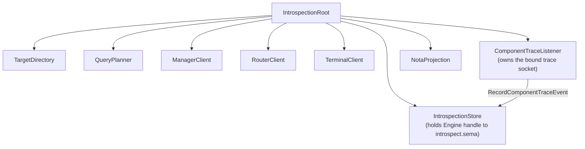

# introspect - architecture

*Persona inspection-plane daemon and CLI.*

## 0. Intent

`introspect` is the prototype's inspection-plane component. It is
supervised alongside the operational first stack and gives the engine a way to
explain itself through typed component observations. Its purpose is a witness,
not a broad UI: the concrete first goal is that after a fixture is delivered,
`introspect` asks the running components for typed observations and prints one
NOTA proof of what happened.

It is not in the message delivery path. It proves the delivery path after the
fact; it is never in the delivery path itself.

## 1. Owned surface

- `introspect-daemon`
- `introspect` CLI
- `meta-introspect` CLI
- Kameo actors for query planning, target directory, target clients, NOTA
  projection, and `IntrospectionStore` (state-bearing local store).
- `ManagerClient`, `RouterClient`, `TerminalClient` — Kameo actors
  that hold each peer daemon's socket path and send typed Signal
  requests to that peer's observation contract. Each client owns
  one peer relationship and is the sole path from
  `IntrospectionRoot` to that peer. `RouterClient` is the first
  live client: when a router socket is configured,
  `prototype_witness()` sends `RouterRequest::Summary` over a
  length-prefixed `signal-router` frame and composes the
  typed reply into `PrototypeWitness.router_seen`. `ManagerClient`
  and `TerminalClient` remain scaffolds until their peer observation
  contracts and daemon ingress paths land.
- `ComponentTraceListener` — Kameo actor that owns the bound
  component-trace ingestion socket. Emitting components (spirit
  first, router next) PUSH `signal_introspect::ComponentTraceEvent`
  frames over `triad_runtime::trace`; the listener PULLs them off the
  socket on a background blocking drain loop (the same `spawn_blocking`
  socket discipline `RouterClient` uses) and forwards each as
  `RecordComponentTraceEvent` to `IntrospectionStore`. An empty
  configured trace path disables ingestion (mirrors the empty-peer-socket
  convention). The wire record is the shared `signal-introspect`
  contract type, so neither end depends on the other.
- Fan-out to component daemons over Signal.
- Fan-in of typed observations as pushed subscription deltas.
- **`introspect.sema`** — introspect's own typed database,
  consumed through `sema-engine`. Stores: query/reply/error audit
  trail (landed); subscription registrations; delivery trace
  cache keyed by `DeliveryTraceKey` (landed), populated today by
  typed ingress into `IntrospectionRoot` and eventually by Subscribe
  deltas from peer Tap streams; component-internal trace events in the
  `component_trace_events` table, keyed `engine/component/sequence:020`
  (mirroring the delivery-trace record key) so a key-range scan over one
  component returns its events in monotonic emission order. Observations
  are persisted as typed records.
- NOTA projection for humans, agents, and future UIs.

`DeliveryTraceKey` is introspection-domain state — an
introspection-owned key for joining router, harness, and terminal
observations that belong to the same message-delivery trace. It is
not a Signal exchange identifier and not request/reply correlation.
Transport ordering and reply matching belong to the Signal frame
layer; delivery-trace joining belongs to introspect's own
store. The key has four fields:
`engine`, `message_identifier`, `originator`, and `hop_index`. The
first three fields join one message-delivery chain; `hop_index`
orders the observed hops without relying on clocks. The store uses
the join portion as the key-range prefix, then sorts the returned
events by `hop_index`.

## 2. Non-ownership

This component does not own:

- peer component database files
- component row definitions
- router policy
- terminal delivery policy
- manager lifecycle policy

Every live observation crosses a component daemon boundary. Peer state
is reached only through peer daemon sockets and component contracts —
**never by opening peer database files**. Offline store readers, if they
ever exist, are separate debug tools.

`introspect` depends on `sema-engine` for its own
`introspect.sema`. That is a one-way dependency; `sema-engine`
knows nothing about introspect.

## 3. Actor map

## 4. Constraints

| Constraint | Witness |
|---|---|
| The daemon does not open peer database files. | Source scan and tests: no `redb::Database::open` in live path against peer paths. |
| The daemon consumes `introspect.sema` through `sema-engine`. | `tests/store.rs`: root-handled requests persist a typed observation record, and the reopened store exposes the `sema-engine` operation log. Source scan: `Engine::open` call exists; no direct `redb` or `sema::Sema::open_with_schema` calls in this repo. |
| `introspect-daemon` starts from binary Signal configuration, not NOTA. | `tests/daemon.rs`: rkyv configuration file is accepted by the real process entrypoint; inline NOTA and `.nota` files are rejected by the generated `DaemonCommand<IntrospectionDaemon>`. |
| The working and meta CLIs each take one NOTA argument or NOTA file and speak only to daemon sockets. | `tests/daemon.rs::introspect_cli_reaches_working_socket_and_prints_typed_witness`; `tests/daemon.rs::meta_introspect_cli_reaches_policy_socket_and_prints_typed_rejection`. |
| The CLI renders NOTA only at the edge. | CLI and projection tests; component clients return typed Signal replies; no daemon-local shadow NOTA codec is used in the runtime path. |
| Prototype witness travels through Kameo actor root. | `tests/actor_runtime_truth.rs`. |
| The daemon binds `introspect.sock` and serves Signal frames. | `tests/daemon.rs` via `checks.*.test-daemon-socket`. |
| The daemon applies the configured working and owner-meta socket modes. | `checks.*.test-daemon-applies-configured-socket-mode`; `checks.*.test-daemon-answers-typed-meta-policy-relation`. |
| The meta socket speaks `meta-signal-introspect`, not the older supervision relation. | `tests/daemon.rs::daemon_answers_typed_meta_policy_relation` sends `Operation::Configure` and receives typed `RequestUnimplemented(NotBuiltYet)`. |
| Component observations remain component-owned. | Dependency graph: wraps `signal-introspect`; target observation records come from each peer's own contract (`signal-router`, `signal-terminal`, `signal-engine-management`, etc.). |
| Every `IntrospectionRequest` variant arrives as a contract-local operation head. | `signal-introspect` declares the operation heads and the daemon codec accepts one typed `signal-frame` payload per request. Sema classification remains daemon-internal. |
| Peer observation is push subscription when the peer stream exists; before the stream lands, a prototype one-shot router observation query is allowed only as an explicit witness path and never as a timer loop. | Source scan: no timer loops in `ManagerClient`/`RouterClient`/`TerminalClient`. `tests/actor_runtime_truth.rs::prototype_witness_queries_live_router_summary_socket` proves the current router path sends one typed `RouterRequest::Summary` frame and receives one typed reply. Future Subscribe paths must follow `skills/subscription-lifecycle.md`. |
| Subscription forwarding goes through `sema-engine`'s `Subscribe` primitive. | Source scan: `Engine::subscribe` is the only path that registers introspect-side subscriptions to peer streams. |
| Pushed component-internal trace events are ingested over a socket, persisted, and served by a typed `ComponentTrace` query filtered by component and event name. | `tests/component_trace.rs::pushed_signal_trace_events_are_ingested_and_queryable_by_component_and_name` spawns the real `IntrospectionRoot` with a temp trace socket, pushes three `ComponentTraceEvent`s through `TraceLog::socket`, and asserts the `ComponentTrace` query returns three in sequence order, then exactly one under an `event_name` filter. |
| `DeliveryTraceKey` is introspection-domain state and has four fields: engine, message identifier, originator component, and hop index. | `signal-introspect` round trips the key; `tests/store.rs::delivery_trace_query_returns_four_hops_ordered_by_trace_key` records matching and nonmatching events, range-queries by the join key, and reads back only the four matching hops ordered by `hop_index`. |
| `RouterClient` asks `RouterRequest::Summary` over the router socket when one is configured; `prototype_witness` composes the typed `RouterSummary` reply into `PrototypeWitness.router_seen`. | `tests/actor_runtime_truth.rs::prototype_witness_queries_live_router_summary_socket` starts a live router-frame peer socket, runs the real `IntrospectionRoot`, and asserts `router_seen == Some(ComponentReadiness::Ready)`. |
| Subscription open returns a typed snapshot and the per-stream token. | Per-peer client tests assert the first reply is the contract's typed snapshot record. |
| Subscription deltas push as typed events; consumers do not poll. | Source scan: no timer-based loops in client actors; each client opens one Subscribe stream per peer. |
| Subscription close is a typed Retract request; the final acknowledgement is a typed reply. | Per-peer client tests assert close → final ack → stream end. |

## 5. Status

The daemon binds a Unix socket, applies the requested socket mode
when supplied, and serves `signal-introspect` frames
through the Kameo root. It also binds the owner meta socket and serves
`meta-signal-introspect` frames; `Configure` is admitted to the wire but
returns typed `RequestUnimplemented(NotBuiltYet)` until hot reconfiguration
has a reducer. `IntrospectionStore` consumes
`introspect.sema` via `sema-engine`; the query/reply audit trail
is persisted as typed records through `Engine::assert`.

The remaining work:

- **Per-peer observation contracts.** Each peer's
  peer component contract carries its own observation request
  vocabulary (terminal, router, manager). `ManagerClient`,
  and `TerminalClient` are scaffolds today: they hold socket paths
  and supervise cleanly, but `prototype_witness()` returns `None`
  for their readiness fields until the contracts ship and the
  daemons accept the corresponding `*Frame` ingress. Destination:
  each client opens one Subscribe stream against its peer; deltas
  land in the local store.

  `RouterClient` is the first wired client. The router daemon
  accepts `signal-message` frames for message ingress and
  `signal-router::RouterFrame` observation frames for read-side
  observation. The router observation plane (Kameo
  `RouterObservationPlane`) answers `RouterRequest::Summary`,
  `RouterRequest::MessageTrace`, and `RouterRequest::ChannelState`.
  `RouterClient` sends a real `RouterFrame` observation request for
  `RouterSummaryQuery`, parses the typed `RouterSummary`
  reply, and `prototype_witness()` composes the result into
  `PrototypeWitness.router_seen` as `Some(ComponentReadiness::Ready)`
  when the engine identifier matches.

  Push subscription wiring follows the canonical lifecycle named
  in `~/primary/skills/subscription-lifecycle.md`: typed Subscribe
  request, typed snapshot reply, typed delta events, typed Retract
  close, final typed acknowledgement, end. The introspect store
  consumes the deltas through `Engine::assert` so the audit trail
  remains durable.
- **Subscription primitive in sema-engine.** `Engine::subscribe`
  is the only path that registers introspect-side subscriptions
  to peer streams. Gated on sema-engine's per-peer
  commit-then-emit semantics. Destination: `SubscribeComponent`
  wire variant + forwarded peer subscriptions + cache-backed
  `DeliveryTrace`. Until then, `DeliveryTrace` is populated by the
  root's typed delivery-trace event ingress; an empty event vector
  means no correlated Tap events have arrived for the query key.
