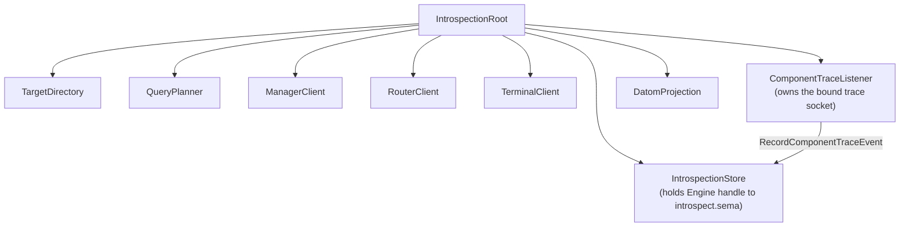

# introspect - architecture

*Persona inspection-plane daemon and CLI.*

## 0. Intent

`introspect` is the prototype's inspection-plane component. It is
supervised alongside the operational first stack and gives the engine a way to
explain itself through typed component observations. Its purpose is a witness,
not a broad UI: the concrete first goal is that after a fixture is delivered,
`introspect` asks the running components for typed observations and prints one
datom proof of what happened.

It is not in the message delivery path. It proves the delivery path after the
fact; it is never in the delivery path itself.

The component is named `introspect` (no `persona-` prefix) and builds on the
triad runtime interfaces. It is the workspace's configurable trace
destination: every component decides what and how it logs by directing its
trace at this component, and `introspect` becomes a queryable source of
tracing-derived intelligence about the running system. It is also the home for
cross-version error logs — full failed messages preserved in version-encoded
form so a later build can decode and recover them — and the durable capture
point for Pi-library agent activity (inputs, outputs, commands run, command
outputs, and agent inference).

The deeper principle: for a tool-using agent, persistent memory **is** the
queryable tool-call trace, not the model context window. A structured tool
protocol gives perfect recall by construction (an MCP-first property a
UI-driving agent cannot match), so `introspect` exposes a `query_history` path
back to the agent — structured filter, summary-on-demand, or vector retrieval —
and the same property generalizes to any tool-using agent (deploy automation,
browser-use, video editing).

## 1. Owned surface

- `introspect-daemon`
- `introspect` CLI
- `meta-introspect` CLI
- The uniform daemon shell (`src/daemon_shell.rs`): argv, binding, the two
  listener tiers, the connection spine, and the exit report. It was emitted by
  `schema-rust`'s daemon emitter while that emitter existed; `schema-rust` has
  since deleted it, so the shell is introspect's own source. Nothing in it is
  component-specific — everything component-specific reaches it through the
  `ComponentDaemon` hooks.
- Kameo actors for query planning, target directory, target clients, datom
  projection, and `IntrospectionStore` (state-bearing local store).
- `ManagerClient`, `RouterClient`, `TerminalClient` — Kameo actors
  that hold each peer daemon's socket path and send typed Signal
  requests to that peer's observation contract. Each client owns
  one peer relationship and is the sole path from
  `IntrospectionRoot` to that peer. `RouterClient` is the first
  live client: when a router socket is configured,
  `prototype_witness()` sends `RouterRequest::Summary` over a
  length-prefixed `signal-router` exchange frame and composes the typed reply
  into the router position of `PrototypeWitnessObservation`. `signal-router`
  is a peer contract still on the `signal-frame` exchange envelope, so this
  one path keeps the envelope while introspect's own planes carry bare Signal
  frames. `ManagerClient`
  and `TerminalClient` remain scaffolds until their peer observation
  contracts and daemon ingress paths land.
- `ComponentTraceListener` — Kameo actor that owns the bound
  component-trace ingestion socket. Emitting components (spirit
  first, router next) PUSH `signal_introspect::ComponentTraceEvent`
  Signal frames over `triad_runtime::trace` — `TracedComponentEvent` is the
  one place the contract's `Signal<ComponentTraceEvent>` bytes meet the trace
  socket, so both ends agree on the wire by agreeing on the contract; the
  listener PULLs them off the
  socket on a background blocking drain loop (the same `spawn_blocking`
  socket discipline `RouterClient` uses) and forwards each as
  `RecordComponentTraceEvent` to `IntrospectionStore`. An empty
  configured trace path disables ingestion (mirrors the empty-peer-socket
  convention). The wire record is the shared `signal-introspect`
  contract type, so neither end depends on the other.
- Fan-out to component daemons over Signal.
- Fan-in of typed observations as pushed subscription deltas.
- **`introspect.sema`** — introspect's own typed database,
  consumed through `sema-engine`. Stores: query/reply/error audit
  trail (landed); subscription registrations; delivery trace
  cache keyed by `DeliveryTraceObservationKey` (landed), populated today by
  typed ingress into `IntrospectionRoot` and eventually by Subscribe
  deltas from peer Tap streams; component-internal trace events in the
  `component_trace_events` table, keyed `engine/component/sequence:020`
  (mirroring the delivery-trace record key) so a key-range scan over one
  component returns its events in monotonic emission order. Observations
  are persisted as typed records. Persisting trace events here is the
  persist-to-SEMA sink choice; the daemon-emitted binary frames are the same
  whether a client persists them or only displays them.
- The datom text plane for humans, agents, and future UIs
  (`src/datom_text.rs`). Every contract type is generated from an ethos root
  and carries `Compositional` and `Datomizable`, so a CLI argument is read by
  walking the expected type and a reply is written by the exact reverse
  projection. There is no hand-written projection of a reply enum onto text.
- Consumer-side readings of the contract types (`src/contract.rs`). The
  contract declares shapes and nothing else, so the admission policy for a
  targeted system event, its exact-duplicate identity, and the meaning of each
  ordinal position of `CoalescedSystemEvent` are introspect's behaviour and
  live here.
- Targeted typed system-event admission and query over the ordinary Signal
  socket. `signal-introspect` owns the recursive domain/target/topic/curated
  event-error vocabulary. `IntrospectionStore` validates privacy invariants
  through `contract::validate_system_event`,
  coalesces exact duplicates per boot, and persists typed summaries in the
  `system_event_summaries` family. Exact identity is computed only after typed
  extraction/redaction and excludes event identifiers and timestamps: it is
  the canonical datom text of the event with those two positions normalised
  away, which is sound because datom text is the schema-driven projection of
  the value.
- `ExactDuplicateCoalescer` is a named mechanism distinct from similarity,
  cooldown, debounce, sampling, token-bucket limiting, or recurring-pattern
  policy. Its active set is capped at 10,000 keys; interval closure, explicit
  flush, shutdown, and eviction have separate typed closure reasons. Warning
  and error events are never sampled.

Trace client behaviour is a reusable client **library**, not per-component CLI
glue. The library owns both display and SEMA-log features; each component's
trace CLI is a thin wrapper that enables and calls those features rather than
reimplementing listener and decoder logic. The generic CLI trace-siting path
lives as a `triad-runtime` helper, not one-off emitter glue.
A client therefore chooses its sink: display the stream as datom, or persist to
a SEMA database purpose-built for trace storage (the same `introspect.sema`
shape). The emitting daemon emits typed binary trace frames regardless of which
sink a client picks.

Tracing is an **ethos-defined interface**, not an ad-hoc string log. Trace
names and events are closed generated enum vocabularies: the generator emits
trace names directly from the ethos enum-variant structure, which already owns each
activated object's identifier, so instrumentation records only that object name
rather than a rich per-boundary payload snapshot. The trace hooks live on the
generated engine traits themselves as default derived no-op
implementations — on the interface and actor contract, not as separate
`SignalTrace` / `NexusTrace` / `SemaTrace` side traits — and a trace build
overrides the default or installs a sink. Two trace forms exist: `COMPACT`
carries only the root variant name; `EXTENDED` appends the nested variant chain
when a variant payload is itself an enum and stops at the root when the payload
is a struct, with the enum-vs-struct distinction known to the generator at compile
time.

`DeliveryTraceObservationKey` is introspection-domain state — an
introspection-owned key for joining router, harness, and terminal
observations that belong to the same message-delivery trace. It is
not a Signal exchange identifier and not request/reply correlation.
Transport ordering and reply matching belong to the Signal frame
layer; delivery-trace joining belongs to introspect's own
store. The key has four positions:
`engine_identifier`, `message_slot`, `component_name` (the originator), and
`hop_index`. The first three join one message-delivery chain; `hop_index`
orders the observed hops without relying on clocks. The store uses
the join portion as the key-range prefix, then sorts the returned
events by `hop_index`.

## 2. Non-ownership

This component does not own:

- peer component database files
- component row definitions
- router policy
- terminal delivery policy
- manager lifecycle policy

Every live observation crosses a component daemon boundary. Peer state
is reached only through peer daemon sockets and component contracts —
**never by opening peer database files**. Offline store readers, if they
ever exist, are separate debug tools.

`introspect` depends on `sema-engine` for its own
`introspect.sema`. That is a one-way dependency; `sema-engine`
knows nothing about introspect.

## 3. Actor map

```mermaid
graph TD
    root["IntrospectionRoot"]
    directory["TargetDirectory"]
    planner["QueryPlanner"]
    manager["ManagerClient"]
    router["RouterClient"]
    terminal["TerminalClient"]
    trace["ComponentTraceListener<br/>(owns the bound trace socket)"]
    store["IntrospectionStore<br/>(holds Engine handle to introspect.sema)"]
    projection["DatomProjection"]

    root --> directory
    root --> planner
    root --> manager
    root --> router
    root --> terminal
    root --> trace
    root --> store
    root --> projection
    trace -->|RecordComponentTraceEvent| store
```

## 4. Constraints

Every row names a witness that runs. A claim without a running witness is not
a constraint; it is an intention, and belongs in §5.

| Constraint | Witness |
|---|---|
| The daemon consumes `introspect.sema` through `sema-engine`. | `tests/store.rs::introspection_root_records_observations_through_sema_engine`: a root-handled query persists a typed observation record, and the reopened store exposes the `sema-engine` operation log with the expected table and record key. |
| `introspect-daemon` starts from binary Signal configuration, not text. | `tests/daemon.rs::daemon_configuration_accepts_binary_file_argument` and every `DaemonProcess::spawn`: the real process entrypoint takes one rkyv file. Inline text and text files are refused by `DaemonCommand::configuration`, which accepts only `ComponentArgument::SignalFile`. |
| The working and meta CLIs each take one datom argument or datom file and speak only to daemon sockets. | `tests/daemon.rs::introspect_cli_reaches_working_socket_and_prints_typed_witness`; `tests/daemon.rs::meta_introspect_cli_reaches_policy_socket_and_prints_typed_rejection`. Both build the argument with `datom_text::textualize` and read the printed datom back. |
| The text plane is the contract's own codec, at the edge only. | `tests/datom_text.rs`: query, response, and both meta values round-trip through their datom text; a hand-typed `PrototypeWitnessObservation.{ prototype }` actualizes into the contract query; a malformed text faults with its datom layer and path. No codec is hand-written anywhere in the runtime path. |
| Prototype witness travels through the Kameo actor root. | `tests/actor_runtime_truth.rs::prototype_witness_uses_introspection_root_actor`. |
| Every public actor noun is data-bearing. | `tests/actor_discipline_truth.rs::public_actor_nouns_carry_data`. |
| The daemon binds `introspect.sock` and serves `Signal<Query>` / `Signal<Response>` frames. | `tests/daemon.rs::daemon_serves_prototype_witness_over_signal_socket` and `daemon_serves_scaffold_observation_responses_for_all_query_families`, via `checks.*.test-daemon-socket`. |
| The daemon applies the configured working and owner-meta socket modes. | `checks.*.test-daemon-applies-configured-socket-mode`; `checks.*.test-daemon-answers-typed-meta-policy-relation`. |
| The meta socket speaks `meta-signal-introspect` as a bare Signal frame. | `tests/daemon.rs::daemon_answers_typed_meta_policy_relation` sends `Query::Configure` and receives typed `RequestUnimplemented(NotBuiltYet)` naming `MetaIntrospectOperationKind::Configure`. |
| Component observations remain component-owned. | Dependency graph: introspect declares no observation record of its own. Every wire type comes from a peer's `ethos/signal.ethos` — `signal-introspect`, `signal-persona`, `signal-message`, `signal-router`. |
| Every query variant arrives as one ethos-root `Query` value. | The daemon restores exactly one `Signal<Query>` per connection; the closed `Query` enum is generated from the contract's ethos root, so an unknown variant cannot be formed. Sema classification remains daemon-internal. |
| Peer observation is push subscription when the peer stream exists; before the stream lands, a prototype one-shot router observation query is allowed only as an explicit witness path and never as a timer loop. | `tests/actor_runtime_truth.rs::prototype_witness_queries_live_router_summary_socket` proves the current router path sends one typed `RouterRequest::Summary` frame and receives one typed reply. Future Subscribe paths must follow `skills/subscription-lifecycle.md`. |
| Pushed component-internal trace events are ingested over a socket, persisted, and served by a typed `ComponentTrace` query filtered by component and event name. | `tests/component_trace.rs::pushed_signal_trace_events_are_ingested_and_queryable_by_component_and_name` spawns the real `IntrospectionRoot` with a temp trace socket, pushes three events through `TraceLog::<TracedComponentEvent>::socket`, and asserts the `ComponentTrace` query returns three in sequence order, then exactly one under an event-name filter. |
| Targeted system events cross the ordinary binary Signal socket, coalesce exactly, persist, and return through typed query. | `tests/daemon.rs::targeted_system_event_socket_ingestion_is_durable_and_typed_queryable` drives two duplicate warning events through the real daemon socket and reads one durable typed summary with count/first/last/suppressed identity. |
| Active duplicate keys are bounded and closure causes stay distinct. | `tests/coalescer.rs` covers exact identity, interval closure, explicit and shutdown flush, boot partitioning, and observable eviction and cardinality. |
| Unclassified targeted input never retains a message preview. | `contract::validate_system_event` refuses it at admission. The contract no longer carries this policy, so it is introspect's: the store calls it before any coalescing or persistence. |
| Adding the system-event family does not rewrite old archives. The sema kernel remains schema version 3 because existing families are byte-identical; the additive `system-event-summary` family starts at archive version 1. | `tests/store.rs::additive_system_event_table_migration_keeps_version_three_observations_readable` creates a pre-family version-3 store, then opens it with the new registration and reads the old observation. |
| `DeliveryTraceObservationKey` is introspection-domain state with four positions: engine identifier, message slot, originator component name, and hop index. | `tests/store.rs::delivery_trace_query_returns_four_hops_ordered_by_trace_key` records matching and non-matching events, range-queries by the join key, and reads back only the four matching hops ordered by `hop_index`. |
| Bounded retention reclaims the oldest diagnostic rows. | `tests/store.rs::bounded_observation_retention_reclaims_oldest_rows`; `tests/store.rs::bounded_trace_retention_keeps_a_finite_queryable_window`. |
| `RouterClient` asks `RouterRequest::Summary` over the router socket when one is configured, and composes the typed `RouterSummary` reply into the router position of `PrototypeWitnessObservation`. | `tests/actor_runtime_truth.rs::prototype_witness_queries_live_router_summary_socket` starts a live router-frame peer socket, runs the real `IntrospectionRoot`, and asserts the router readiness position is `Some(ComponentReadiness::Ready)`. |
| Every dependency is pinned by an immutable `rev`. | `Cargo.toml`: no `branch` key appears on any git dependency. |

## 5. Status

The daemon binds a Unix socket, applies the requested socket mode
when supplied, and serves `signal-introspect` frames
through the Kameo root. It also binds the owner meta socket and serves
`meta-signal-introspect` frames; `Configure` is admitted to the wire but
returns typed `RequestUnimplemented(NotBuiltYet)` until hot reconfiguration
has a reducer. `IntrospectionStore` consumes
`introspect.sema` via `sema-engine`; the query/reply audit trail
is persisted as typed records through `Engine::assert`.

The remaining work:

- **Per-peer observation contracts.** Each peer's
  peer component contract carries its own observation request
  vocabulary (terminal, router, manager). `ManagerClient`,
  and `TerminalClient` are scaffolds today: they hold socket paths
  and supervise cleanly, but `prototype_witness()` returns `None`
  for their readiness positions until the contracts ship and the
  daemons accept the corresponding Signal ingress. Destination:
  each client opens one Subscribe stream against its peer; deltas
  land in the local store.

  `RouterClient` is the first wired client. The router daemon
  accepts `signal-message` frames for message ingress and
  `signal_router::Frame` observation frames for read-side
  observation. The router observation plane (Kameo
  `RouterObservationPlane`) answers `RouterRequest::Summary`,
  `RouterRequest::MessageTrace`, and `RouterRequest::ChannelState`.
  `RouterClient` sends a real `RouterFrame` observation request for
  `RouterSummaryQuery`, parses the typed `RouterSummary`
  reply, and `prototype_witness()` composes the result into
  the router readiness position of `PrototypeWitnessObservation` as
  `Some(ComponentReadiness::Ready)`
  when the engine identifier matches.

  Push subscription wiring follows the canonical lifecycle named
  in `~/primary/skills/subscription-lifecycle.md`: typed Subscribe
  request, typed snapshot reply, typed delta events, typed Retract
  close, final typed acknowledgement, end. The introspect store
  consumes the deltas through `Engine::assert` so the audit trail
  remains durable.
- **Subscription primitive in sema-engine.** `Engine::subscribe`
  is the only path that registers introspect-side subscriptions
  to peer streams. Gated on sema-engine's per-peer
  commit-then-emit semantics. Destination: `SubscribeComponent`
  wire variant + forwarded peer subscriptions + cache-backed
  `DeliveryTrace`. Until then, `DeliveryTrace` is populated by the
  root's typed delivery-trace event ingress; an empty event vector
  means no correlated Tap events have arrived for the query key.
- **Trace enablement and the testing log surface.** Trace enablement is
  controlled and documented per crate or component, since interfaces may
  enable or suppress tracing independently; the tracing interface itself
  stays untraced for now so the trace system never recursively traces its
  own events. In testing mode the CLI is the log surface: the log socket
  routes back to the CLI, which displays all engine logs over the same wire
  substrate as production interaction, with no separate logging daemon or
  sink, and the routing is configured by typed datom. Generated objects
  carry optional-compilable, feature-gated logging hooks at the macro and
  emitter layer — off in production, on in testing — that log object usage
  through that same socket.
